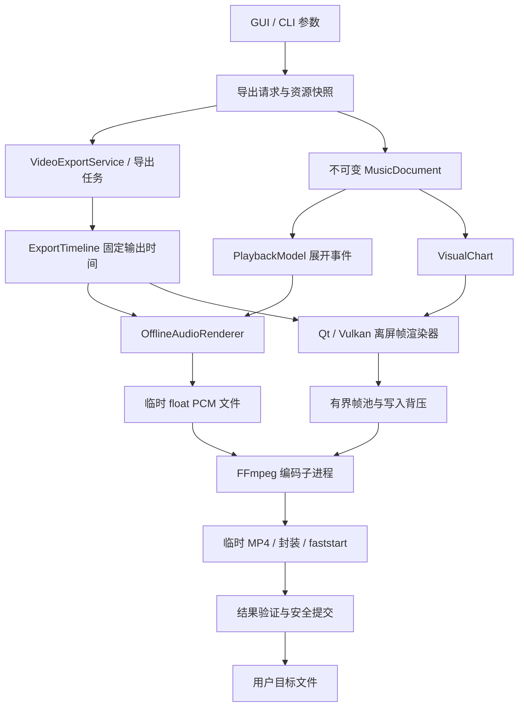

# MP4 离屏视频导出：可行性分析与完整开发方案

状态：Vulkan 首版已实现，视频音频同步改进已完成专项验证。分析及实现记录日期：2026-10-05；同步验证更新日期：2026-10-06。

本分支的产品约束已经确定：视频导出只使用 Vulkan 离屏渲染；FFmpeg 不随程序打包，设置页支持 PATH 自动探测或手动选择目录；传统 Qt 模式、FFmpeg 检查中或 FFmpeg 无效时，视频按钮禁用并显示具体原因。本文保留完整的设计依据，同时在“当前实现”段落标注已经落地的内容和仍需扩大验证的范围。

目标是把用户截图红框内的下落音符、背景、触发线和键盘，按照音乐时间线离线渲染为带声音的 MP4。本文基于当前 C++20 / Qt 6.8 / FluidSynth / Qt 与 Vulkan 双渲染后端的实际代码，区分现有能力、建议设计和待验证事项。

## 1. 结论与推荐路线

**技术上可行，项目已经具备音乐时间线、独立离线音频合成和按指定时间绘制画面的基础。主要开发量在真正的 Vulkan 离屏渲染、视频编码接入及导出任务工程化。**

推荐把目标定义为“音乐驱动的离线成片”，由输出帧号和音频采样号决定时间。生成速度可以快于或慢于实时播放；窗口最小化、遮挡、拖动进度和修改设置都不应改变已经启动的导出任务。

推荐首个正式版本采用以下组合：

| 项目 | 推荐 |
| --- | --- |
| 输出范围 | 红框对应的音乐演奏场景，按几何语义确定边界 |
| 输出格式 | MP4，H.264 视频 + AAC-LC 双声道音频 |
| 常用规格 | 1920×1080、60 FPS；另提供 720p、30 FPS |
| 渲染 | Vulkan 真离屏保留流光效果；Qt/QImage 提供普通画面兼容模式 |
| 时间驱动 | 固定帧率、有理数时间计算、采样精确的事件调度 |
| 音频 | 独立 FluidSynth 离线实例，44.1 kHz，复用现有 MP3 导出的合成路径，保留节拍器与尾音语义 |
| 编码接入 | 固定版本的 FFmpeg 子进程；视频流式输入，音频先生成浮点 PCM 临时文件 |
| 基础编码器 | 软件 H.264 保证一致质量；硬件编码属于后续加速选项 |
| 任务管理 | 不可变任务快照、有界缓冲、阶段进度、取消、安全提交成品 |

选择 FFmpeg 子进程是为了先获得可靠的双流编码、封装和进程故障隔离。正式部署必须选择并审核具体构建；如果随包提供 libx264，则需要处理 FFmpeg/x264 构建对应的 GPL 发行义务。项目当前为 MIT，不能直接把本机完整 GPL 构建当作无需审核的发行依赖。

如果产品明确要求发行包只引入宽松或 LGPL 依赖，推荐改为经过验证的 LGPL FFmpeg 构建配合 `h264_mf` 和原生 AAC，或者实现 Windows Media Foundation 编码适配器。这项选择应在第一个原型阶段确定；其余时间线、渲染、任务与 UI 设计可以共用。

## 2. 现有架构与可复用能力

| 现有模块 | 实际作用 | 本功能的复用方式 |
| --- | --- | --- |
| `MusicDocument`、`PlaybackTimeline` | 统一音乐数据、速度映射和反复展开 | 作为唯一音乐语义来源 |
| `PlaybackModel` | 生成展开后的全局事件和状态快照 | 直接作为合成事件源 |
| `PlaybackVisualizationProjector`、`VisualChart` | 生成音符、延音、鼓轨、网格、歌词等视觉数据 | 生成与音频同源的画面模型 |
| `AudioExportService` | 独立合成器、采样边界调度、MP3/WAV 导出、取消 | 提取音频块生产逻辑，继续供音频导出使用 |
| `SceneLayoutEngine` | 音符区域、触发线、键盘、鼓区与简谱布局 | 复用几何算法，增加明确的导出布局策略 |
| `FallingNotesRenderer` | QPainter 分层渲染 | 包装为 QImage 离屏帧渲染器 |
| `VulkanScene` | GPU 实例、UI 批次、文字图集和特效参数 | 复用场景数据生成与着色器 |
| `FallingNotesVulkanWindow` 的私有 renderer | 窗口设备、交换链、资源和命令提交 | 抽取有限的公共绘制代码，新增独立离屏资源管理 |
| `MainWindow::exportAudio()` | 参数弹窗、异步任务、进度、取消 | 沿用交互及异步管理习惯 |
| Windows 打包脚本 | 依赖部署、许可证、闭包和 smoke 检查 | 增加编码工具及视频成品验证 |

主要源码入口：

- [离线音频服务](../src/app/audioexportservice.cpp)、[音频导出选项](../src/app/audioexportservice.h)。
- [离线 FluidSynth](../src/infrastructure/audio/fluidsynthengine.cpp)、[现有编码与安全写入](../src/infrastructure/encoding/audiofileencoder.cpp)。
- [CLI 指定时间渲染](../src/cli/main.cpp)、[Qt 渲染分层 API](../src/presentation/visualization/fallingnotesrenderer.h)。
- [场景几何](../src/presentation/visualization/scenegeometry.h)、[场景布局](../src/presentation/visualization/scenelayoutengine.cpp)。
- [Vulkan 场景](../src/presentation/visualization/vulkanscene.cpp)、[窗口 GPU renderer](../src/presentation/visualization/fallingnotesvulkanwindow.cpp)。
- [着色器](../src/presentation/visualization/shaders/note.vert)、[现有 Vulkan 生命周期约束](vulkan-rendering.md)。
- [GUI 音频导出流程](../src/presentation/mainwindow.cpp)、[构建](../CMakeLists.txt)、[Windows 打包](../scripts/Build-Windows.ps1)。

当前分支已经加入 FFmpeg 子进程编码、浮点 PCM 临时音频、独立 Vulkan framebuffer 离屏渲染、GPU readback、MP4 完整性检查和 QSaveFile 安全提交。Qt 后端仍可用于技术对比和传统实时播放，但不属于视频导出产品路径；导出按钮只在 Vulkan 已解析完成且 FFmpeg 检查通过时启用。

另外，`FallingNotesRenderer::render()` 当前没有接收背景图片。导出需要调用已有的分层背景 API，或增加带背景参数的入口，否则容易得到“音乐和键盘正确、图片背景丢失”的结果。

## 3. 红框的产品边界

### 3.1 导出的内容

包含：下落音符、长音及踏板尾段、音高分区、小节和节拍横线、图片或主题背景、触发线、活动琴键及八度标签；存在鼓轨时包含鼓轨及鼓键。简谱、歌词、乐段标记按照冻结的显示设置保留。

排除：操作系统标题栏、应用顶部工具栏、乐曲标题与顶部 BPM 信息、底部进度条和播放按钮、截图上的红框及说明文字。截图左侧小节编号边栏和用于填充边栏的装饰琴键，也默认排除。

歌词、标记目前属于场景内部 overlay，和顶部应用标题不同。默认保留，可在高级选项中单独关闭。若未来需要视频标题、字幕或片尾，应作为明确的新输出元素设计。

### 3.2 范围必须通过语义计算

先在冻结的逻辑场景尺寸上计算 `PlaybackSceneGeometry`，再确定导出矩形：

```text
left   = 有效 pianoRect 与 drumRect 中最靠左的边界
right  = 有效 pianoRect 与 drumRect 中最靠右的边界
top    = fallingRect.top()
bottom = keyboardRect.bottom()
```

只有鼓轨时以 `drumRect` 为水平边界；普通旋律以 `pianoRect` 为边界；混合编制包含两者及其间隔。几何无效时应报参数或布局错误。不能按截图像素、当前窗口屏幕坐标或固定的左侧偏移裁剪。

### 3.3 画幅与布局

截图区域的宽高比未必是 16:9。“保留当前构图”和“填满标准画幅”需要分别定义：

| 模式 | 行为 | 建议 |
| --- | --- | --- |
| 保留当前构图 | 冻结当前逻辑布局，语义裁剪后等比放入目标画布，余量使用固定底色 | 默认，最接近截图 |
| 保留原比例 | 选择输出宽度，自动计算偶数高度，不添加边带 | 自定义规格选项 |
| 填满画幅 | 在导出参考画布重新布局，关闭导出用边栏，场景占满输出区域 | 显式选择，预览确认 |

不建议通过非等比拉伸填满，也不建议默认切掉最高音、最低音或键盘。1080p 首次预览必须能看见完整有效键盘。

首版采用整个展开后乐曲；变速支持冻结为 20%～200% 的固定倍率。任意片段、批量任务、硬件编码、4K 高规格作为后续阶段，仍应在内部接口中预留。

## 4. 技术路线比较

### 4.1 画面获取

| 路线 | 是否独立于窗口 | 流光效果 | 质量和工程判断 |
| --- | --- | --- | --- |
| 桌面/窗口录制 | 否 | 只能保留实际呈现的效果 | 受遮挡、帧率和实时播放影响，不符合离线成片目标 |
| QWidget 截图 | 否；对嵌入的 Vulkan 原生窗口也不可靠 | 不保证 | 不适合作为导出核心 |
| 隐藏 QVulkanWindow + `grab()` | 仍依赖 surface、交换链和窗口生命周期 | 可用于原型比较 | 会同步等待 GPU，不能作为正式架构 |
| QImage + QPainter | 是 | 普通画面 | 成熟可用，适合兼容模式及第一阶段贯通 |
| 独立 Vulkan image/framebuffer | 是 | 可以共享现有着色器 | 满足截图效果，开发及 GPU 验证成本最高 |

若用户将红框效果视为产品要求，完整交付必须包含 Vulkan 离屏能力。仅交付 Qt 普通画面应被标识为兼容模式或阶段成果。

### 4.2 编码集成

| 路线 | 优点 | 成本及限制 | 定位 |
| --- | --- | --- | --- |
| FFmpeg 子进程 | 参数透明，编码与 MP4 封装成熟，故障隔离，易做 smoke | 可执行依赖、管道管理、具体构建许可，首版需音频临时文件 | 推荐首版 |
| libavcodec/libavformat 直接集成 | 精确 PTS、双流内存提交，未来适合减少临时 I/O | API、帧重排、音频 FIFO、版本与 DLL 维护成本更高，GPL 组件不能因动态链接而忽略许可 | 长期演进 |
| Windows Media Foundation | Windows 系统组件，H.264/AAC 与硬件能力 | 平台专用，MFT/COM、像素格式和码控适配，不同机器能力差异 | Windows 发行约束明确时的替代路线 |
| Qt Multimedia 录制接口 | Qt API 风格 | 现有项目未依赖；仍需核实帧输入、精确时间戳、编码和部署后端 | 暂不选作核心 |

Vulkan 渲染和硬件编码是两项独立能力。GPU 绘制后读回 CPU，再送 NVENC，并不等于零拷贝。首版不承诺 Vulkan 图像直接进入硬件编码器。

## 5. 总体架构与执行流程



首版流水：校验并冻结请求 → 构建音乐和视觉模型 → 初始化字体、背景与独立合成器 → 离线生成音频 PCM → 启动编码器 → 逐帧离屏渲染并写入编码器 → 关闭视频输入、等待编码 flush 和 MP4 封装 → 检查结果 → 安全提交目标文件。

音频先完成后，编码器从 PCM 文件读取声音，视频只占用一个 stdin 管道。这比同时管理两条跨进程输入管道更容易控制背压和取消；不会损失同步精度，因为时间由文件样本数和视频帧号确定。

不产生整曲 PNG 序列，也不产生整曲未压缩视频文件。音频临时文件的体积可预测；成片完成或任务失败后按任务资源所有权清理。

## 6. 模块与接口设计

以下模块已按职责落地；后续优化仍可在这些接口上演进：

| 位置 | 模块 | 职责 |
| --- | --- | --- |
| `src/app` | `VideoExportService`、`VideoExportOptions` | 参数验证、任务编排、结果与进度 |
| `src/app` | `ExportTimeline` | 帧号、输出时间、音乐时间、事件采样位置、总长度 |
| `src/app` | `OfflineAudioRenderer` | 从 PlaybackModel 生成 PCM 块、尾音、峰值统计 |
| `src/app` | `IVideoFrameRenderer`、帧与渲染请求类型 | 定义按指定音乐时间生成画面的契约 |
| `src/presentation/visualization` | `ExportSceneSnapshot`、`ExportLayoutPolicy` | 冻结显示资源和语义导出几何 |
| `src/presentation/visualization/offscreen` | `QtOffscreenFrameRenderer` | QImage 分层绘制及静态缓存 |
| `src/presentation/visualization/offscreen` | `VulkanOffscreenFrameRenderer` | 独立设备、离屏目标、同步、读回 |
| `src/infrastructure/encoding` | `FfmpegVideoEncoder` | 子进程、输入管道、诊断、封装结束 |
| `src/infrastructure/encoding` | `SafeOutputCommit` | 临时成品验证及安全覆盖提交 |
| `src/presentation` | 视频导出对话框与任务控制 | 预览、参数、进度、取消、完成行为 |
| `src/cli` | `--export-video` | 自动化导出与包内 smoke |

当前 core 同时编译 app、domain、infrastructure、presentation，暂不需要为了该功能重构整个构建层次。新服务应通过渲染接口和工厂接收具体后端，由 GUI/CLI 的组合入口提供，避免 app 服务持有窗口或直接操作 QWidget。

建议的契约示意：

```cpp
struct FrameRate { int numerator; int denominator; };
struct PlaybackRate { int numerator; int denominator; };

struct FrameRequest {
    qint64 index;
    qint64 musicPositionUs;
};

// VideoFrame 拥有或租用帧池内存，明确 size / stride / pixelFormat。
// renderer 和 encoder 分别由其工作线程持有，不能引用实时窗口资源。
class IVideoFrameRenderer {
public:
    virtual ~IVideoFrameRenderer() = default;
    virtual bool initialize(const FrameRenderConfig&, QString* error) = 0;
    virtual bool render(const FrameRequest&, VideoFrame&, QString* error) = 0;
};
```

首版同步 `render()` 也可以先完成正确性贯通；后续扩展 submit/readback 异步帧环时，依然保持帧序、时间契约与编码器接口稳定。

不宜直接在 MainWindow 中添加整套采样、GPU 和编码循环，也不宜把界面定时器或 PlaybackSession 当作视频时钟。

### 6.1 线程与任务所有权

| 执行位置 | 所有权与工作 | 约束 |
| --- | --- | --- |
| GUI 主线程 | 对话框、快照采集、节流后的进度展示、关闭协调 | 不执行整曲合成、逐帧渲染或阻塞式进程等待 |
| ExportWorker 的专用 QThread | 音频阶段拥有 FluidSynth；视频阶段拥有离屏设备、scene、图集和缓存 | 不访问 QWidget，不跨线程共享可变 Vulkan 资源 |
| EncoderIoWorker 的专用 QThread | 创建并拥有 QProcess，保持事件循环，消费有界帧队列，读取日志和退出状态 | 不在事件槽中无限等待帧生产者 |
| FFmpeg 子进程 | 颜色转换、编码线程和封装 | 不读取应用播放状态或用户设置 |

首版使用单个帧生产者。队列拥有帧缓冲或明确转移所有权，消费完成前不能复用。队列满时渲染工作线程可以等待；取消、编码器退出和错误必须唤醒所有等待者。进程 I/O 独立运行，防止长帧绘制阻塞日志读取和 QProcess 写缓冲排空。

控制器持有任务句柄和完成状态，收到任务完成后再销毁 worker/thread。关闭应用时先取消并异步收尾，再销毁渲染及编码依赖；销毁 QFutureWatcher 或仅设置一个取消标志不等于工作已经结束。预览使用独立实例和配置代次，参数变化后丢弃过期结果。

## 7. 不可变任务快照

冻结内容包括：document 和 chart 的版本、展开后播放顺序、主题、音符配色、简谱/歌词/标记显隐、背景像素及布局/透明度、逻辑参考尺寸、字体和字体回退、lookahead、特效开关/级别、输出尺寸/FPS/质量、固定速度、SoundFont、节拍器和尾音、起止范围、输出路径。

音乐与视觉模型必须来自同一份 document，不能捕获当前 chart 后又从修改中的其他乐曲生成音频。快照不包含 GUI 对象、实时合成器指针、窗口 framebuffer 或正在变化的候选音符 span。

背景需要在准备阶段完成解码，并保存独立像素数据。仅保存文件路径不能冻结内容。SoundFont 则应在准备阶段独立加载，固定引擎参数，并检查加载前后的文件信息；如果资源在加载中改变，任务明确失败。需要严格可重复归档时，可额外记录资源散列或使用任务副本。

现有背景 loader 把最大边限制为 2048。首版“匹配当前画面”可以使用冻结的同一背景像素；4K 高质量导出若需要更清晰背景，应增加独立的受内存上限控制的解码尺寸策略，并说明重新解码可能与实时画面的纹理采样略有差别。

## 8. 逻辑尺寸、DPI 和裁剪变换

现有键盘高度被限制在 88～132 个逻辑像素，简谱高度在 24～38 个逻辑像素。直接以 3840×2160、DPR=1 重新布局，会让键盘在画面中的相对高度发生明显变化。因此必须把“逻辑构图”和“视频像素尺寸”分开。

保留当前构图模式冻结 GUI 视图的逻辑尺寸，计算原始几何与语义裁剪框，然后映射到输出：

```text
s = min(outputWidth / cropWidth, outputHeight / cropHeight)
offset = (outputSize - s × cropSize) / 2
outputPoint = offset + s × (logicalPoint - cropTopLeft)
```

CPU 使用同一个变换和裁剪；GPU 在最终顶点映射中应用相同的原点偏移与尺度，内部音符裁剪和背景 UV 继续采用逻辑场景坐标。文字图集按导出采样尺度生成，不能把已有窗口 DPR 无条件叠加。每帧最终格式必须为规定的物理宽高。

现有着色器只有尺寸和 `dpr`，没有导出原点偏移，因此需要扩展明确的场景到输出变换；默认窗口路径使用恒等偏移。C++ push constants 与两个 shader 的 ABI 必须同时更新并测试。

另一种实现是先绘制整个场景再 GPU 裁剪/缩放，但会多占一个目标图像及带宽。可用于早期原型，不建议默认用 CPU 缩小已经生成的低分辨率画面。

输出 H.264 4:2:0 宽高应为偶数。奇数请求应在对话框显示实际调整值，不得无声拉伸。超出设备 `maxImageDimension2D`、字体图集和内存预算时要在开始前拒绝。

## 9. 统一时间与音画同步

### 9.1 基本定义

令帧率 `F = p/q`，采样率 `S`，播放倍率 `α = r/s`，展开后音乐区间 `[A, B)`，片头静音 `L` 秒，尾音 `R` 秒。这里的区间是展开后的演奏位置，不能用重复前的小节编号直接表示。

```text
第 n 帧的输出时间： t_out(n) = n × q / p
第 n 帧的音乐时间： t_music(n) = A + α × (t_out(n) - L) × 1,000,000
音乐事件 e 的样本号： sample(e) = round(S × [L + (e - A) / (α × 1,000,000)])
请求时长： D = L + (B - A) / (α × 1,000,000) + R
总视频帧数： N = ceil(D × p / q)
视频实际时长： D_video = N × q / p
音频有效样本数： M = round(D_video × S)
```

全部从帧号/事件时间重新计算，使用有理数与经检查的整数乘除，明确一次性的舍入规则。不能通过不断累加 `16,667 us` 或通过墙上时间推进，否则长视频会漂移。MSVC 不应假定支持 GCC 的 `__int128`；实现需要约分、溢出检查或适合当前工具链的宽乘除工具。

首版支持 30/1 和 60/1；内部保留分母，后续可支持 30000/1001、60000/1001。当前视频产品路径固定使用 44.1 kHz，与现有 MP3 导出的 FluidSynth 配置保持一致；60 FPS 每帧对应 735 个采样帧，30 FPS 每帧对应 1470 个采样帧。编码器底层仍接受 48 kHz，以便未来扩展，但视频服务当前不使用该路径。分数帧率则按绝对位置交替分配采样，不能固定截断每帧样本数。

音频总长度对齐视频最后一帧的完整显示区间，额外不足一帧的部分用尾音继续合成或静音补齐。不要使用 `-shortest` 隐藏总长度计算错误。

### 9.2 音乐结束与尾音

统一以 `PlaybackModel` 时长、最后事件时间及视觉时长的有效最大值确定整曲结束，发现不合理差异时记录诊断。现有音频导出已经会考虑最后事件时间；视频必须遵循同样的结束语义。

音乐结束时释放 sustain、sostenuto 和音符，让合成器继续产生设定的尾音。画面时间仍向前推进，使尾段和余辉自然消退；不能直接使用实时 Stop/Finished 状态，因为播放器会归零。尾音阶段也不能不断重画音乐结束瞬间的“琴键仍按下”画面。

对于未来片段导出，应过滤区间结束后的新音符，并对跨终点音符定义释放语义。尾音需要与经过截断的视觉状态对应。固定尾音不保证每个 SoundFont 的长混响都完全消失；可以提示或提供更长尾音，自动静音检测属于后续选项。

### 9.3 片头与速度

默认片头 0 秒，符合当前播放器从音乐零点开始的行为。高级选项可提供静音预滚，让开头音符先从上方下落；此时渲染器必须支持负音乐时间，而不是把所有片头帧钳制为 0。

固定速度要同时改变事件采样位置与画面音乐位置。建议保持现有播放器的“改变 MIDI 事件间隔”语义，音高不变，SoundFont 包络按输出真实秒运行。这不是先合成再改变 PCM 采样率，也不需要时间伸缩算法。现有 AudioExportOptions 没有速度字段，因此这是音频生产逻辑需要新增的能力。

保持共享 lookahead 的音乐时间语义后，200% 速度时音符的屏幕运动也变快。若想始终看到固定的输出秒数，需要额外的窗口模式，首版不要混用两种规则。

### 9.4 精度和容器边界

音频事件调度误差应不超过半个采样的舍入误差；可见的触发时刻受一帧量化限制。不能把“画面只在某帧发生变化”误判为音频采样不精确。

AAC 通常以 1024 个采样分包，并有编码预延迟和末包填充。必须依赖并验证 MP4 对有效起止的表示，不能把编码包样本数直接当作歌曲长度。按 presentation timestamp 检查画面顺序；启用 B 帧时 decode timestamp 与 presentation timestamp 本来就可以不同。

最终验收同时检查：源事件到 PCM 的位置、PCM 有效长度、容器时间戳、播放器实际解码后的起止和同步。不同 SoundFont 的自然起音包络不是调度延迟，音画测量应使用已标定的脉冲或短打击音夹具。

### 9.5 两条音乐投影链路的一致性

统一输出时钟之外，还需要验证声音事件与视觉音符的音乐语义。当前 `PlaybackEventsRenderer` 在微秒时长上应用部分奏法和力度，`PlaybackVisualizationProjector` 则在 tick 上独立处理时长与连音，并保留原始力度。跨 tempo 音符、连音及表达法可能因此产生差异；不能仅凭它们来自同一 MusicDocument 就承诺完全一致。

建议以 PlaybackModel 最终规范化的事件为声音基准，在 ExportTimeline 准备阶段校验对应 VisualChart 的起止、反复实例与踏板语义。若需要修正，应提取公共的演奏时间解析逻辑，并回归实时播放和旧音频导出。按源音符 ID、反复实例、音轨和声部关联，不能仅按时间和音高匹配重叠音。

视觉 `audibleEndUs` 表示踏板等音乐语义的结束，不能解释为每个 SoundFont 的声学包络恰好归零。测试分别检查事件边界、视觉量化与真实音源听感；额外尾音用于保留合成器释放和混响。

## 10. 离线音频生产器改造

从当前 `AudioExportService::exportDocument()` 提取以下职责到共享 `OfflineAudioRenderer`：构建/接收 PlaybackModel、事件与节拍器索引、微秒到采样的转换、事件边界切块、独立 FluidSynth 初始化、乐曲终点释放、PCM 块输出、非有限采样检查、峰值和削波统计、取消。

MP3/WAV 导出继续使用原编码器消费 PCM，默认参数和已有输出语义保持兼容。视频导出用另一消费者写 interleaved stereo float32 little-endian 临时 PCM。音频块仍可采用最多 4096 帧，在块内遇到事件时拆分。

必须保留同时间戳事件的现有稳定顺序。变速后多个事件可能舍入到同一个采样号，处理完这个位置的全部事件后再渲染，避免零长度块循环和同键 NoteOff/NoteOn 顺序变化。

首版不通过 MP3 再解码生成视频音轨，以免重复有损编码和引入 MP3 延迟；也不直接依赖现有 16-bit WAV 作为最高质量中间格式。浮点 PCM 不受 RIFF 4 GB 头部限制，但仍需要文件大小、时长和磁盘空间的受控上限。

当前 synth gain 使用既有引擎默认值。建议首版保留原来的听感并统计削波，提供完成警示或明确的输出增益选项；响度归一化、限制器等会改变声音，可作为独立能力，不宜无声加入。

视频中的节拍器默认为关闭，通过复选框开启；启用后必须使用同一反复展开和倍率。SMPTE MIDI 沿用固定音乐时序，其现有节拍器不可用规则保持一致，应给出具体原因。

## 11. 真正的 Vulkan 离屏渲染

### 11.1 所有权与资源

离屏 renderer 创建或持有独立 Vulkan instance/device、图形队列、command pool、pipeline、descriptor、背景纹理、文字图集、实例缓冲及颜色目标。没有 swapchain，也不请求 present surface；导出线程拥有设备及其生命周期。

建议首版使用独立 device，避免导出与实时窗口在同一个 queue 上竞争资源和同步。它会增加设备初始化与显存开销，但所有权更清晰；后续才评估共享 device。设备选择记录名称和 UUID，并检测所需格式、队列和容量。

离屏颜色图像使用受支持的 RGBA8/BGRA8 UNORM 格式，带 `COLOR_ATTACHMENT` 和 `TRANSFER_SRC` 用途。颜色和混合规则先匹配现有实时后端；不能仅因更换 sRGB attachment 就改变原有亮度。图像最终合成为不透明帧，MP4 不承载当前场景的 alpha。

### 11.2 渲染与读回

初始正确性版本可以单槽等待 fence；正式性能版本使用 2～3 个在途槽：

```text
等待槽位的上一轮 fence 完成
→ 更新该槽的实例/图集与 command buffer
→ 绘制到离屏 image
→ COLOR_ATTACHMENT_WRITE 到 TRANSFER_READ 的同步与布局转换
→ vkCmdCopyImageToBuffer 到 readback buffer
→ GPU 完成后建立 HOST_READ 可见性
→ 非 HOST_COHERENT 内存按要求 invalidate
→ 打包或租用 CPU 帧缓冲，按帧号交给编码器
→ 槽位恢复可用
```

每个在途槽必须持有或正确保护自己的可写实例、readback 和上传资源；静态纹理仅在没有并发写入时才能共享。即使晚提交的帧先完成，送入 rawvideo 管道的次序也必须是 0、1、2……。

检查行跨度、RGBA/BGRA 排列、上/下方向和奇数尺寸。编码器要求每帧连续的 `width × height × 4` 字节；QImage 的 `bytesPerLine()` 或 GPU buffer padding 不能直接误当连续有效像素。

不要逐帧调用 `vkDeviceWaitIdle()` 作为最终同步方案。fence/槽位保护足够时才能复用缓冲；取消期间仍需完成有界的 GPU 清理。device lost 直接使任务失败，不应在同一个 MP4 中突然切换为不同效果的 Qt 画面。

### 11.3 复用现有代码的边界

优先复用 `VulkanScene`、材质、字体布局、层顺序、shader 和实例 ABI。抽取公共 pipeline 配置、batch draw 和有限的资源工具，让窗口 renderer 与离屏 renderer 共用绘制规则；交换链资源分配和同步继续由窗口路径管理。

窗口当前存在 Qt 6.8 WSI 信号量兼容处理：`completePresentation()` 会等待 queue/device idle。离屏无 WSI，可以使用自己的 fence 并行；不能为了导出吞吐量直接删除实时窗口的既有等待。任何公共绘制代码调整都要重新跑连续呈现和同步验证，单张截图不足以证明生命周期正确。

### 11.4 长视频与特效时钟

当前 `VulkanScene::timeOriginUs()` 基本保持 0，音符时间以 float 秒上传。长视频时 float 精度下降，24 小时附近的间隔可达数毫秒，可能影响高帧率画面。

建议周期性移动时间原点，使可见音符和当前音乐位置用同一局部秒数。原点改变时推进相关缓存 revision。流光相位要单独保持连续：不能简单重置 shader 的 position，否则反光会在重基准帧跳变。脉冲和确定性粒子也必须从指定时间计算，而非随机数、墙上时间或历史帧状态。

同一配置、同一后端和设备上的重复导出，应有相同的输入帧序列；不同 GPU/驱动和有损编码器不要求输出文件逐字节相同。

## 12. Qt 离屏兼容模式

使用独立 QImage、QPainter、renderer 和缓存，按 exact `transportPositionUs` 绘制。`transportState` 在正常音乐帧使用 Playing 语义，以显示琴键反馈；`loading=false`、无错误 overlay，`effectsStartUs` 取任务开始的音乐边界，不能继承一次实时 seek 的状态。

复用静态背景和键盘缓存，以及 `VisibleNoteIndex` / `VisibleNoteWindowCache` / `NoteRenderCache`。每帧只更新候选音符、动态琴键、时间网格和歌词标记；候选索引容器必须在一次渲染完成前有效。

字体需要冻结 GUI 实际字体和回退策略；在 headless CLI 中使用 QGuiApplication 并初始化字体环境。工作线程绘制 QImage，避免使用 QWidget/QPixmap 或跨线程共享可变渲染缓存。

本次 headless CLI 样图中观察到部分标签呈方框，应把字体和缺字检查列为原型验收项。输出分辨率正确，并不能证明中文歌词、鼓键名和八度标签正确。

UI 明确显示“普通画面”和“保留流光效果”两种能力。若选择保留效果而 Vulkan 不可用，应在开始前提示原因，让用户明确切换普通画面；任务开始后不做无提示的后端降级。

## 13. FFmpeg 编码与封装

### 13.1 输入与编码参数

视频输入是固定帧率 raw BGRA/RGBA，不带 alpha 透明语义。音频输入为 44.1 kHz、双声道 interleaved float32 little-endian，长度由统一时间线决定；编码器保留 48 kHz 参数能力，但产品路径必须与音频导出使用同一采样率。

推荐基础 preset：H.264、8-bit YUV420P、软件 CRF 20、medium，AAC-LC 192 kbps，MP4 faststart。提供“高质量”可使用 CRF 17～18，“较小文件”可使用 CRF 23；实际画质需要用细网格、窄长音、渐变和移动背景检验。CRF 不保证固定体积。

720p 可用 High level 3.2；1080p60 通常需要至少 level 4.2；4K60 需要匹配 level 5.2 和解码器能力。不要所有分辨率固定为同一个低 level。GOP 可设约 2 秒，以兼顾拖动定位和压缩。

FFmpeg 参数结构示意如下，颜色滤镜和最终编码 profile 应由验证后的 preset 构造：

```text
ffmpeg -nostdin -hide_banner -loglevel warning -progress pipe:2
  -f rawvideo -pixel_format bgra -video_size 1920x1080 -framerate 60/1 -i pipe:0
  -f f32le -ar 44100 -ac 2 -i <task-audio.pcm>
  -map 0:v:0 -map 1:a:0
  -c:v libx264 -preset medium -crf 20 -pix_fmt yuv420p
  -c:a aac -b:a 192k
  -movflags +faststart -f mp4 <unique-task-output.partial.mp4>
```

这是参数设计示意，不是已接入程序的命令。实际使用 QProcess 的 program + QStringList arguments，路径不经 shell 拼接；不依赖用户 PATH 上的随机 FFmpeg 版本。

### 13.2 色彩

冻结背景的色彩空间并规范到场景采用的 RGB 空间，再合成。视频编码明确 RGB 满幅值到 BT.709 YUV limited range 的矩阵、传递函数与标记；不能只写 BT.709 tags 而忽略转换。

若规范源为 sRGB，应评估带显式 transfer 转换的 `zscale` 路径，并把 libzimg 纳入所选 FFmpeg 构建及许可证；若采用其他经过验证的转换器，也必须记录完整转换策略。实时 UNORM 混合的视觉结果是基准，首版不顺带重做线性光渲染。

4:2:0 会降低彩色细边缘和文字的色度分辨率，这是兼容性取舍。应在 1 像素色线、灰阶、纯黑/纯白、透明背景叠加、浅色主题和高强度光晕上比较解码图像。高 CRF 可能造成细线闪烁，不能只看静止截图。

### 13.3 背压、退出与诊断

QProcess::write() 可能只是把数据放入 Qt 内部写缓冲。需要依据 `bytesToWrite()` 设置最大待写量，建议不超过 1～2 帧，循环处理短写、等待可写和取消，不能无限 write 全曲帧。

持续读取 stderr 中的 progress 和 warning/error，保留有界的最后诊断文本，防止子进程因 stderr 填满而停住。正常结束关闭 stdin，继续等待编码包 flush、moov 和 faststart 完成；仅关闭管道不能宣布成功。

取消时停止生产，通知并结束子进程，短时等待后必要时强制结束；最终结果归类为 Canceled。检测崩溃、非零退出、零帧/零时长、磁盘不足及输出头损坏，并提供具体错误。

初期采用软件编码，后续引入 NVENC/QSV/AMF 时，做一次短实际编码探测。`-encoders` 只证明编译了接口，不证明显卡、驱动、会话和目标规格支持。编码器在任务开始前选定；中途失败不能直接追加其他编码器的码流。

## 14. 文件安全、任务状态与取消

状态机建议为：`Preparing → RenderingAudio → RenderingVideoAndEncoding → Finalizing → Validating → Committing → Succeeded`，各阶段可转入 `Canceled` 或 `Failed`。取消提交点之前有效；安全提交已经完成后，结果应按成功处理。

临时 MP4 使用目标目录内唯一名称，音频可放受控任务临时目录。编码器只写自己的临时文件，永远不先截断用户已有目标文件。目标不能覆盖输入音乐、SoundFont、背景、编码工具或任何当前任务资源，并处理路径别名与 Windows 文件共享失败。

首版安全提交可沿用 QSaveFile：把验证后的 MP4 按有限大小块复制到 QSaveFile，再 commit，禁用直接写入降级。这样复用当前音频导出的安全习惯，但额外需要一次成片复制和一份成片磁盘空间。进度要包含这一阶段。

后续可实现经验证的 Windows 同卷安全替换以减少复制。不能用“先删除旧文件再 rename”的方式替代事务提交。对于网络共享、非标准文件系统，需实测覆盖与失败语义。

取消和失败清理按任务资源清单进行，不按宽泛通配符删除目录。进程异常退出遗留的任务文件，可以在下次启动时根据所有权、任务状态和保留期限清理。错误诊断日志不含完整用户私有文件内容。

取消检查点包括音频块、帧生成、等待 GPU、等待管道、子进程退出和成片复制。正常 CPU/I/O 条件下，目标是用户取消后约 1～2 秒内响应；驱动失联、系统休眠和内核 I/O 卡死不能承诺同样上限。

## 15. 性能与资源预算

以下是数据量估算，不是当前代码实测吞吐量：

| 分辨率 | RGBA 单帧 | 60 FPS 未压缩传输 | 六份帧级内存 |
| --- | --- | --- | --- |
| 1280×720 | 3.69 MB | 221 MB/s | 22.1 MB |
| 1920×1080 | 8.29 MB | 498 MB/s | 49.8 MB |
| 3840×2160 | 33.18 MB | 1.99 GB/s | 199 MB |

采用十进制 MB；六份仅为示例帧槽，并不包含显存目标、readback、图集、实例、SoundFont 和编码器内部参考帧。若同时有六份 GPU 目标和六份 CPU 帧，应分别累加，不能把表格当成进程总内存。

44.1 kHz stereo float32 音频约 21.17 MB/分钟，10 分钟约 211.68 MB。10 分钟 1080p60 的 RGBA 原始视频约 299 GB，因此全量缓存原始视频或逐帧 PNG 会产生不必要的磁盘成本。

MP4 大小可粗估为 `(视频平均码率 + 音频码率) × 时长 / 8`。例如 10 分钟、视频平均 10 Mbps、音频 192 kbps，约 764 MB；具体 CRF 成片可能差别很大。首版采用 QSaveFile 成品复制时，磁盘预算约为 PCM + 两份成品 + faststart/系统余量。

性能测量应拆分音频合成、布局/实例、GPU 绘制、读回、帧拷贝、色彩转换、编码和最终提交。报告帧/秒、导出倍率、CPU/GPU/显存、内存峰值、临时空间和输出码率。最低要求是内存受控、任务不阻塞 GUI、成片完整；“导出快于实时”只能在规定硬件和规格上作为目标。

先完成正确性，再做静态层缓存、复用帧池、2～3 槽异步读回和硬件编码。4K60 可能先被读回、拷贝和 RGB→YUV 转换限制，单纯提升 shader 帧率并不能解决整条链路。

## 16. GUI 与 CLI 设计

### 16.1 GUI

沿用顶部导出入口，将当前“导出音频”组织为音频/视频选项，避免增加拥挤的独立按钮。视频对话框包含实际裁剪预览和必要参数：目标路径、分辨率、FPS、质量、构图模式、普通/流光画面、固定播放速度、节拍器、尾音。

默认建议：1080p60、均衡质量、保留当前构图、当前主题/背景/显示设置和当前固定播放速度，节拍器关闭，尾音 500 ms。原先的视觉刷新率只影响实时界面，不能被当作导出 FPS。

高级选项可放原比例、自定义偶数尺寸、片头预滚、歌词/标记显隐。预览使用真实导出几何及相同 renderer，在开头、指定时间和密集段采样；无需生成整个视频才知道键盘是否被裁掉。参数变化触发带版本号的异步预览，旧任务结果不能覆盖新预览。

没有 SoundFont 时允许“无音轨视频”，但“带音乐”需要有效 SoundFont；不要暗中生成静音 AAC 假装有音乐。无音轨模式也不需要加载合成器。后端或编码器缺失应在开始前显示具体原因。

进行中的任务显示当前阶段、已完成帧/总帧、进度、耗时、平滑估计剩余时间及取消。音频、视频、封装、提交的阶段权重可在原型测量后确定；100% 必须表示安全提交完成。

首版同时只运行一个视频导出任务。播放和设置可继续使用，但会竞争 CPU/GPU；可以提供明确的导出期间暂停实时播放选项。关闭窗口时存在活动任务，需要呈现等待、取消等正常任务生命周期选择。

完成后提供“打开视频”和“打开所在文件夹”。警告包括削波、尾音可能截断、普通后端效果差异；失败显示可诊断原因，不仅显示“导出失败”。

### 16.2 CLI

建议扩展入口，例如：

```text
midi_play_cli --export-video input.mid output.mp4
  --soundfont piano.sf2 --size 1920x1080 --fps 60
  --renderer vulkan --quality balanced --rate 100 --tail-ms 500
```

提供 `--renderer qt|vulkan`、`--theme`、`--note-colors`、背景和构图参数、`--no-audio`，以及显式覆盖策略。GUI 与 CLI 都调用同一个 VideoExportService。视频模式即使没有 QWidget，也需要 QGuiApplication 来初始化字体和图像相关环境。

CLI 输出阶段与进度到 stderr，结果可选择结构化 JSON；成功/参数错误/运行失败/取消使用稳定退出码。真正离屏 Vulkan 不依赖 Qt 窗口平台提供 Vulkan surface，但具体驱动和会话兼容性仍需测试。

## 17. 测试与验收标准

| 类别 | 关键用例 | 验收要求 |
| --- | --- | --- |
| 时间线 | 30/60、分数 FPS、20/100/200% 速度、长曲、事件同采样 | 总帧/样本公式一致，无累计漂移，无溢出 |
| 音乐语义 | MIDI 0/1/2、SMPTE、MusicXML repeat/ending、tempo、踏板、鼓、tie | 画面与音频使用同一展开顺序；沿用已支持语义 |
| 音频 | 首采样事件、最后事件、密集 CC、节拍器、尾音、削波、取消 | 边界精确，无无效采样；原 MP3/WAV 回归通过 |
| 布局 | 琴键扩展裁剪、纯鼓/混合鼓、窄/宽画幅、简谱、100/150/200% 系统 DPI | 不丢有效琴键/鼓键，不拉伸、不混入控件，输出尺寸固定 |
| 字体/背景 | 中文歌词、缺字回退、PNG/JPEG/WebP、透明/EXIF、背景对齐 | 字体可用，布局和遮罩与预览一致 |
| 渲染 | 两主题、两配色、特效关闭及三级、随机时间直接采样 | 同后端的相同时间得到一致画面，缓存无污染 |
| GPU 生命周期 | 连续离屏渲染至少 1 万帧、多槽复用、device lost、取消 | validation 无错误，无资源竞争；长曲与重基准无跳变 |
| 实时回归 | 现有 Vulkan 连续呈现、主题切换、缩放 | 公共绘制代码变动不引入窗口闪烁或同步问题 |
| 编码/封装 | PTS、B 帧、AAC 起止、完整解码、faststart、损坏输入 | 所有预期帧可解码，呈现顺序正确，无末尾丢帧/早截断 |
| 安全写入 | 已有文件、空间不足、锁文件、取消、子进程崩溃 | 原文件保持完整，不误删用户资源，无孤儿进程 |
| 独立任务 | 导出时暂停/seek/换曲/改主题/缩放/最小化 | 已冻结任务的输入帧与音频不变 |
| 部署 | 无 Qt/FFmpeg/Vulkan SDK 的干净 Windows、中文/空格路径 | 便携包可导出，依赖与许可证完整 |

重要成品验收：

1. 规定测试曲输出帧数严格等于 N；宽高、FPS、视频和音轨规格符合请求。
2. 源事件到 PCM 的采样误差满足明确的舍入规则，长曲无趋势性漂移。
3. 标定音频起音与触发线变化的偏差不超过一帧加采样舍入误差；按首、中、尾多个位置验证。
4. 经容器表示有效范围后，音视频时长差处于一帧或一个 AAC 包的最大量化范围内，同时验证实际首尾内容没有被提前丢弃。
5. 同后端、同布局的导出原始帧与参考画面一致；编码解码后的差异使用质量阈值和视觉检查，不要求有损视频逐像素一致。
6. 1080p60 默认配置下整曲可完成，内存不随已导出时长线性增长。长时稳定性测试先独立检验时钟和采样映射，再运行实际长视频压力测试。
7. 普通取消、失败和覆盖场景保留已有成品；成功仅在验证和 commit 完成后发出。

已有 11 项 CTest 是回归基线，不能替代视频集成和真实 GPU 验证。Qt offscreen 测试也不能证明 Vulkan device、持续 GPU 同步或硬件编码可用。

## 18. 构建、依赖和部署

增加明确的视频导出构建选项；没有编码依赖的构建仍可保留播放器与音频导出。Vulkan 可选构建与视频能力分开：Qt 视频导出不应该被 Vulkan 开关一起关闭。

FFmpeg 子进程路线不必把 FFmpeg 全部加入当前 vcpkg 链接依赖。建议在构建配置中指定受控的编码工具目录，记录版本、构建配置、散列和许可证，安装到发行包的固定 tools 目录；直接 libav 路线才需要相应 CMake/vcpkg 链接和 DLL 闭包。

调整 `Build-Windows.ps1` 和 `ValidateWindowsPackage.cmake`：检查 ffmpeg/ffprobe 与其依赖，部署许可和对应源代码获取/构建说明，离线运行包内工具，导出短测试曲并检查编码类型、尺寸、帧数、时长及完整解码。

GPL/LGPL 要按实际 FFmpeg 配置和组件确认；“通过子进程调用”不等于忽略被分发二进制的许可义务，“动态链接”也不等于 GPL 组件自动变为 LGPL。H.264/AAC 的专利与软件版权许可是不同问题，应按实际发行方式评估。

发行 smoke 使用项目测试资源，保持当前不附带用户乐曲 SoundFont 的规则。性能和 GPU 压力测试在有对应设备的独立环境运行，普通 CI 保留 Qt 普通视频集成测试。

## 19. 分阶段实施与工作量

估算前提：一名熟悉 C++/Qt 的开发者，有可用 Windows/Vulkan 调试设备，不新增复杂剪辑或零拷贝硬件互操作。单位为工程人日，原型后应重新估算。

| 阶段 | 工作 | 可审查交付与退出条件 | 估算 |
| --- | --- | --- | --- |
| P0 技术原型 | 语义裁剪、指定时间 Qt 帧、Vulkan 离屏目标、编码构建与色彩验证 | 5～10 秒真正运动且带声音的 MP4；背景、字体、流光可比较；确定发行编码路线 | 2～4 |
| P1 基础贯通 | 共享 PCM 生产器、ExportTimeline、Qt 帧、FFmpeg 背压/取消/安全提交、CLI | 整曲普通视频稳定完成；时间线和现有音频测试通过 | 5～8 |
| P2 效果交付 | Vulkan 公共绘制提取、离屏 fence/读回、布局变换、背景/字体/特效、长时基准 | 流光视频符合预览；validation 和实时窗口回归通过 | 7～12 |
| P3 产品与发布 | GUI 参数/预览/进度、错误恢复、包内工具/许可、部署及集成验证 | 干净机器一键导出；交互、覆盖、取消和成品验收通过 | 5～8 |

完整基础版本约 **19～32 人日**，单人约 **4～7 个工作周**，具体取决于现有 Vulkan 资源代码的可提取程度和编码发行选择。Qt 普通画面可以先作为阶段版本提供，但截图效果完整交付应等 P2/P3 完成。

后续扩展估算：硬件编码探测与 preset 约 3～6 人日；任意片段与跨边界声音恢复约 3～6 人日；libav 双流内存编码约 5～10 人日；GPU 到编码器零拷贝需单独跨 API 原型，不适合直接给固定交付周期。原生 Media Foundation 编码器替代 FFmpeg 管道，需要追加平台适配和机型测试预算。

任意片段尤其要谨慎：播放器的状态快照能恢复控制器和活动音符，却不能完全恢复合成器包络、样本相位及混响历史。追求片段与全曲截取听感一致时，应从前面预合成并丢弃起点前的 PCM；单纯 seek 后重新 NoteOn 只能得到语义近似。UI 必须把这段准备成本纳入进度。

## 20. 主要风险及处理策略

| 风险 | 影响 | 处理 |
| --- | --- | --- |
| Vulkan renderer 与 QVulkanWindow 耦合 | 离屏实现或公共代码改动引入实时回归 | P0 原型，有限抽取，保持窗口 WSI 约束，双路径压力测试 |
| 构图/DPI/裁剪定义不清 | 输出键盘比例错误或边栏被带入 | 冻结逻辑布局，共享显式变换，参数预览 |
| 时间线独立累加 | 长视频漂移，速度和 repeat 不一致 | 单一 ExportTimeline，绝对帧/采样映射 |
| AAC 延迟与末包 | 首音偏移、末音丢失 | 有效长度、edit/时间戳及解码检查 |
| 管道或队列无界 | 内存增长、任务卡死 | 帧池和 QProcess 待写字节双重上限，持续读诊断 |
| 4K/高 FPS 带宽 | 导出很慢或内存不足 | 预算校验，分阶段开放规格，读回/转换/编码分别测量 |
| 字体和背景变化 | 导出和预览不同、中文缺字 | 冻结资源、初始化字体、缺字和解码用例 |
| 用户取消/磁盘满/崩溃 | 损坏已有文件、遗留进程 | 临时成品、安全提交、统一任务清理 |
| 编码器构建与许可未确定 | 发行失败或部署不完整 | P0 固定构建及发行策略，包内闭包与许可审核 |

## 21. 本次验证及其边界

当前实现位于 `feat/video-export-vulkan` 分支。源码已经包含公共离线音频生产器、ExportTimeline、FFmpeg 探测与编码、Vulkan 离屏 renderer、视频导出任务和 GUI 设置/进度流程。Vulkan Release 构建成功，CTest 回归和视频配置测试共 11/11 通过；传统 Qt-only 构建也通过同一组 11 项回归测试。

本轮使用已有 CLI 对 `tests/fixtures/deployment.musicxml` 执行 `--render-test`，在 `QT_QPA_PLATFORM=offscreen` 下成功生成 1280×720 的项目场景，时间位置为 0，图表时长为 2 秒。该验证没有生成连续动画，也没有测试背景图片和 Vulkan 特效。

本机 PATH 上 FFmpeg 为 7.1.1 gyan.dev full build，构建包含 `--enable-gpl --enable-version3`。用合成测试画面和测试音频编码后，ffprobe 验证为 H.264 / YUV420P、1280×720、60 FPS、120 帧，AAC 44.1 kHz 双声道，音视频均为 2.000 秒。

同时通过 FFmpeg 的 `h264_mf`、`hw_encoding=0` 完成了 1280×720、30 FPS、1 秒软件编码，ffprobe 验证为 30 帧 H.264。这只证明本机该 FFmpeg 构建能调用 Media Foundation 软件编码，不能证明其他机器或独立原生 MF 适配器已验证。

当前机器已执行可选短时集成测试：实际创建音乐文档和 FluidSynth PCM，使用独立 Vulkan 设备连续渲染 320×240、30 FPS 帧，经 FFmpeg 编码为 H.264/AAC MP4，并由 ffprobe 校验尺寸、帧率、帧数和音频规格。该验证不等同于长曲 1080p/4K 吞吐量、硬件编码或 Vulkan validation layer 压力测试；这些仍属于发布前验收项。

## 22. 建议的首个可实施目标

先选一段 10 秒 MIDI 和一段带反复、踏板与鼓轨的 MusicXML，以同一套时间与布局生成 Qt 普通版和 Vulkan 流光版 MP4。要求预览边界正确、背景与字体可读、声画对齐、取消不破坏已有文件，并固定发行用编码器构建。

这个原型通过后，再展开整曲导出、任务 UI、性能优化和发行验证，能尽早确认最昂贵的 GPU 与部署假设，同时保留完整目标的交付标准。

## 23. 视频音频同步改进与验证（2026-10-06）

### 23.1 已确认的问题与诊断边界

用户反馈独立音频导出正常，只有视频音频存在错位、重叠。本轮不改动 `AudioExportService`、`OfflineAudioRenderer` 或 `FluidSynthEngine`，只调整视频时间线、PCM 交接契约和 H.264/AAC 封装。三个文件与本轮开始时的 SHA256 一致。

此前关于同键 NoteOff、共享合成器或效果缓冲叠加的推测，不能直接解释仅视频异常，尚无用户故障文件支持这些判断。AAC 是有损编码，解码波形允许失真，但不应出现时间偏移、重复片段或累计漂移。

对本轮曾尝试的 `-avoid_negative_ts make_zero` 进行了对照实验：30 FPS、2 秒 H.264/AAC MP4 的视频 `start_time` 为 0.066016 秒，音频为 0.045000 秒；保留 MP4 edit list、禁用时间戳整体平移后，两个呈现起点均为 0，时长均为 2 秒。AAC 首包 PTS=-0.021333 秒、`skip_samples=1024` 是正常编码预热信息；H.264 的负 DTS 是帧重排信息，不能据此平移整个成片。

以上实验确认了该尝试会引入额外偏移，已撤销。它不等同于复现用户最初的错位重叠：当前没有该故障的源文件、成品、音源及导出参数，因此仍需使用故障样本做最终对照。

### 23.2 当前实现

- 从音乐时长、速度百分比及固定尾音构造有理数时长，仅在最终视频帧数处向上取整，避免两次舍入多出一帧。
- 以完整视频帧数计算 PCM 长度：`samples = frames * (44100 / fps)`；30/60 FPS 对应每帧 1470/735 个双声道采样帧。该路径与现有 MP3 导出保持同一 FluidSynth 采样率，避免 48 kHz 另一路合成产生不同波形。
- 视频服务检查合成结果样本数和临时 PCM 字节数；编码器再次检查 PCM 长度，同时拒绝多帧或少帧输入。
- rawvideo 与 f32le 输入均从 0 开始，按各自 EOF 完整排空；不再额外使用 `-shortest`、`-t`、`asetpts` 或整体时间戳平移。使用 `-avoid_negative_ts disabled -use_editlist 1` 保留标准 MP4 编码延迟补偿。
- 有 ffprobe 时检查帧数、尺寸、帧率、双声道 44.1 kHz AAC、两个呈现起点和时长；探测异常及超时均明确失败。未安装 ffprobe 时继续支持 FFmpeg 完整解码检查，不将 ffprobe 变为必装依赖。
- 完整解码检查使用进度检测停滞，可取消并有超时保护；验证通过后才原子写入最终文件。

### 23.3 专项测试及结果

`video_encoder_roundtrip` 使用生产编码器，覆盖 30/60 FPS × 50/100/120/150/200% 的 10 组双声道信号，另有两组静音视频。信号在开头、前段、中段、后段、末段各放置不同频率的标记，对解码后的两个声道分别计算相关度和偏移，并检查全段误差及静音间隔。FFmpeg 7.1.1 下 10 组的最大偏移为 **1 个采样**，最小局部相关度约 0.968，全段相对平方误差约 1.05%；视频每帧呈现时间等于 `n / fps`。AAC 启动瞬态允许有损失真，局部相关度阈值为 0.95、偏移阈值为 3 个采样，全段相对平方误差阈值为 2%。解码长度可能因 AAC 帧量化比输入少几个采样帧，测试只允许这一尾部差异，不放宽任何事件位置或重复音频检查。

同时验证不完整 PCM、多帧、少帧、错误预期帧数，以及人为平移 100 毫秒的 MP4 被拒绝。没有 FFmpeg 的环境将该 CTest 标记为跳过，不伪装成完成编码验证。

`midi_play_video_export_tests --integration` 在真实 Vulkan 设备上执行 8 组：30/60 FPS × 50/100/150/200%。文档含多个可发声音符及中途变速；60 FPS 组额外含反复和节拍器。对比基准通过现有 WAV 导出服务生成，速度通过测试文档的 BPM 缩放表达，服务逻辑保持原样。所有成品通过完整音频波形对比和画面非空、运动检查；100% 组直接对应相同原始文档的 WAV 输出。

时间线另覆盖 120% 速度恰好落在帧边界的情况、非整数时长和最长 24 小时音乐输入的整数运算边界。上述短视频验证不替代长曲、不同音源、不同播放器或 1080p/4K 性能验证。

### 23.4 用户样例复现与修正验证

使用用户提供的 `飞侠Shrimp - 至冬堡（夜晚）.mid`、`midisound.sf2`、正常 MP3 和旧版 MP4 做了本机复现。解码时把 MP3、MP4 都规范到 44.1 kHz 双声道 float PCM，并按全曲及多个 2 秒窗口计算相关度。旧版 MP4 的 AAC 流是 48 kHz；重采样后与 MP3 全段相关度仅约 **0.10**，相对平方误差约 **1.81**，各时间窗口无法稳定匹配，和用户听到的严重音色紊乱/重叠相符。

原因是旧视频路径以 48 kHz 实例化 FluidSynth，独立 MP3 以 44.1 kHz 合成。采样率不仅决定 PCM 的时间刻度，也影响 FluidSynth 的合成器状态、插值和效果处理；48 kHz 音频再采样到 44.1 kHz，并不等价于直接以 44.1 kHz 合成。此前聚焦容器时间戳和 AAC encoder delay 的分析只能排除时间戳作为根因，无法解释两个不同采样率下的合成内容差异。

当前视频服务、事件时间线、PCM 长度和 AAC 输入已统一改为 44.1 kHz；30/60 FPS 每帧分别恰好包含 1470/735 个采样帧。原有音频导出入口及 FluidSynth 引擎没有为这次修正改动。用同一 MIDI、SoundFont 和视频服务生成 30 FPS 修正版后，解码 MP4 与现有 MP3 的全段相关度为 **0.9999 以上**，相对平方误差约 **0.0010**；从 0、5、15、30、60、90、120、150 秒到尾段的分段最佳偏移均为 **0 个采样**。新版 MP4 的 AAC 流为 44.1 kHz，音视频呈现起点均为 0。该结果确认采样率路径修正解决了此例中的音频内容偏差。

AAC 有损编码和尾包量化仍会造成小幅波形误差及不足一个 AAC 帧的尾部长度差异；它们不会让中间事件重排。此处比对说明修正视频内容与这份现有 MP3 一致，不替代其他 FluidSynth 版本、SoundFont、导出参数和输出分辨率的验收。

Windows Release 构建命令：

```powershell
powershell -NoProfile -ExecutionPolicy Bypass -File scripts/Build-Windows.ps1 `
  -BuildName video-export-release -PackageName midi-play-video-export-windows-x64
```

本轮 dist Release 构建成功：12 项常规回归通过，编码往返测试因打包脚本清理用户 PATH 而跳过；随后补充外部 FFmpeg PATH，该 CTest 单独执行通过。Windows 依赖闭包、打包后的 CLI 场景渲染及 MP3 导出冒烟均通过。发行包位于 `dist/midi-play-video-export-windows-x64/`，GUI 为 `midi_play.exe`，与 build 目录中 Release 可执行文件的 SHA256 一致。

另外在 PATH 仅提供 FFmpeg、没有 ffprobe 的独立环境重新完成 12 组编码测试，确认可使用完整解码检查完成导出。dist 中未包含 FFmpeg 或 ffprobe。专项编码和 Vulkan 集成需要在运行时 PATH 包含外部 FFmpeg、Qt 及构建目录 DLL 的环境单独执行。本轮保持 `feat/video-export-vulkan` 分支的所有修改未提交。

2026-10-06 用户样例修正后，再次使用 dist 流程构建 Vulkan Release。13 项 CTest 中 12 项通过；脚本运行时从 PATH 清理外部 FFmpeg，因此编码回环按设计跳过，并随后在构建环境手动通过。8 组真实 Vulkan 集成也全部通过。打包 GUI/CLI 依赖闭包与渲染、MP3 smoke 均通过，程序 SHA256 与 Release 构建产物一致，包内没有 FFmpeg/ffprobe。原 `dist/midi-play-video-export-windows-x64` 正被运行中的 GUI 占用，脚本拒绝移动该目录；为保留打开中的进程并交付可用产物，本轮新包输出为 `dist/midi-play-video-export-audio-fix-windows-x64/`，所有源码仍未提交。

## 24. 并发导出第一阶段（2026-10-07）

新分支 `feat/video-export-concurrent-pipeline` 将 Vulkan 离屏导出从每帧同步等待改为有界的三槽流水线。每个槽独立拥有目标图像、command buffer、fence、动态/静态实例 buffer 和 readback buffer；同一个 Vulkan device/queue 仍由导出线程顺序提交，避免多设备和跨线程 Vulkan 资源竞争。

`VulkanOffscreenRenderer` 新增 `beginRender()` / `completeRender()` 两阶段接口。`VideoExportService` 先填充在途槽位，再按 frame index 完成最早帧并提交到有界的 `FfmpegVideoEncoderWorker`，随后提交下一帧。FFmpeg 的 `QProcess` 在专属线程中创建、写入和结束；工作线程按队列顺序消费，容量耗尽时向渲染侧施加背压。这样 GPU 可以处理后续帧，而 CPU 等待 readback 或编码队列；编码器仍只有一个有序写入者，PTS 和帧顺序不变。原同步 `render()` 接口保留给预览及兼容调用。

`VideoExportResult` 现在返回音频合成、视频流水线、封装、完整性校验和安全提交耗时，以及提交/编码帧数和峰值在途帧数。视频集成测试额外断言所有帧都经过并发流水线且至少有两个 Vulkan 帧同时在途。该阶段没有改变音频采样率、ExportTimeline、FFmpeg 参数或最终文件安全提交语义；1080p/4K 长曲吞吐量仍需在目标设备上用这些指标单独标定。
